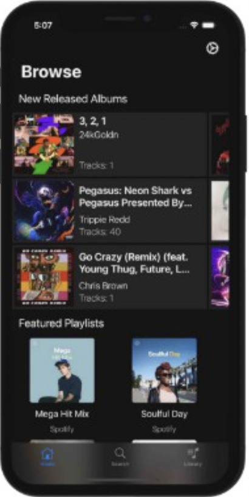
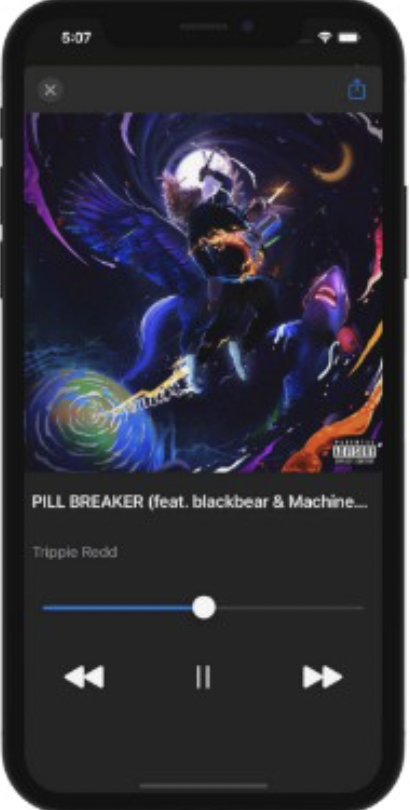
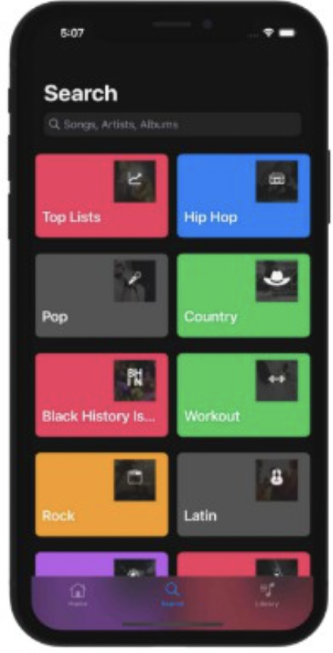
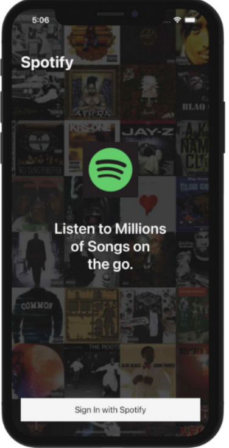
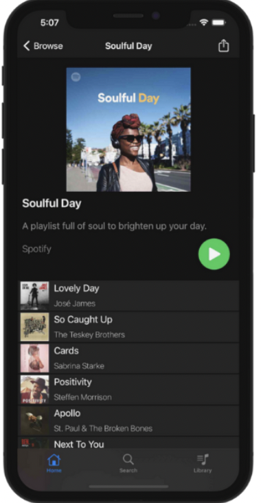
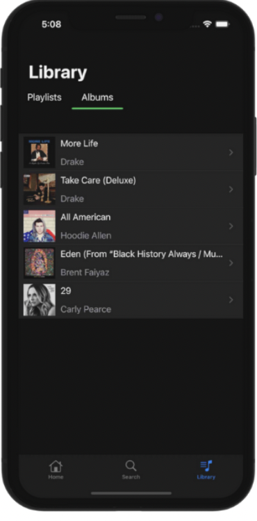

# Spotify Clone App made in swift 5

---

<h2> 
  Full featured Spotify like app written in Swift 5 with MVVM architecture.
</h2>

  
  
  
  
  

  
  
  
  

---

<h2>
  Features
</h2>

- Official Spotify API Use
- Playlists, Playlist Creation,
- Browse & Recommended
- Search Songs, Albums, Artists, More
- Playback and Playlists Playback
- Save Albums
- Sign In/Sign Out (OAUTH 2.0)
- View Your Profile
- Browse Categories
- Categorical Playlists

---

<h2>
  Notes
</h2>

 This code is free to use. Note that Client Id and Client Secret from the AuthManager have to be replaced.
You can obtain your own credentials from the Spotify Developer website.

---
<h2>
  Watch Full Video
</h2>

<a href="https://drive.google.com/file/d/1p8PhvtH8J2Q2SXMfIWM55GBrJuv4xUfu/view?usp=drivesdk"> Click here to Watch the full Functionality. </a>

---

